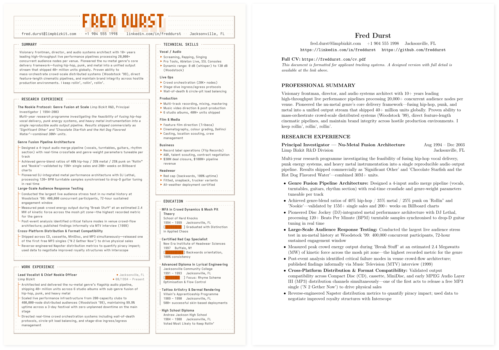
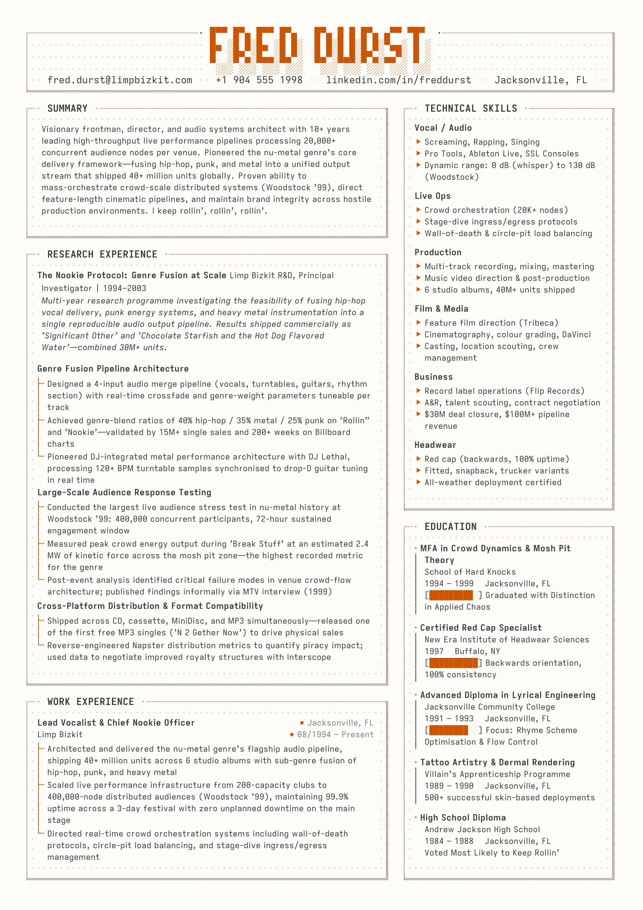
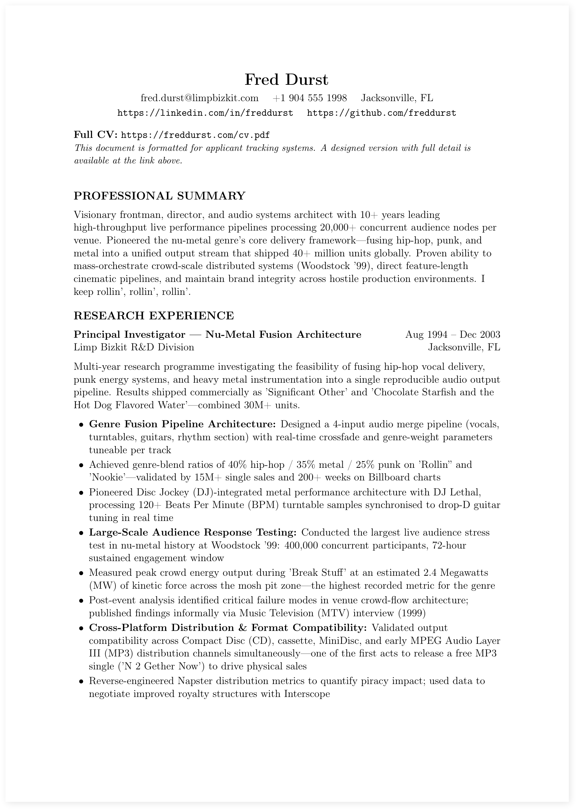
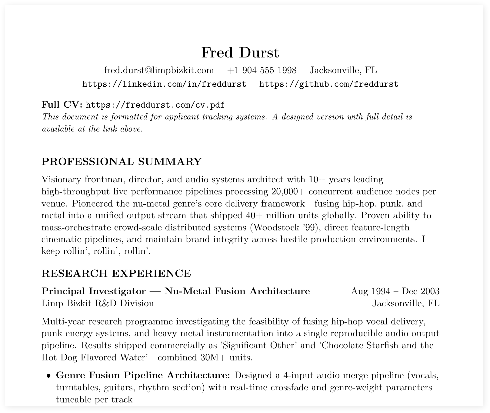
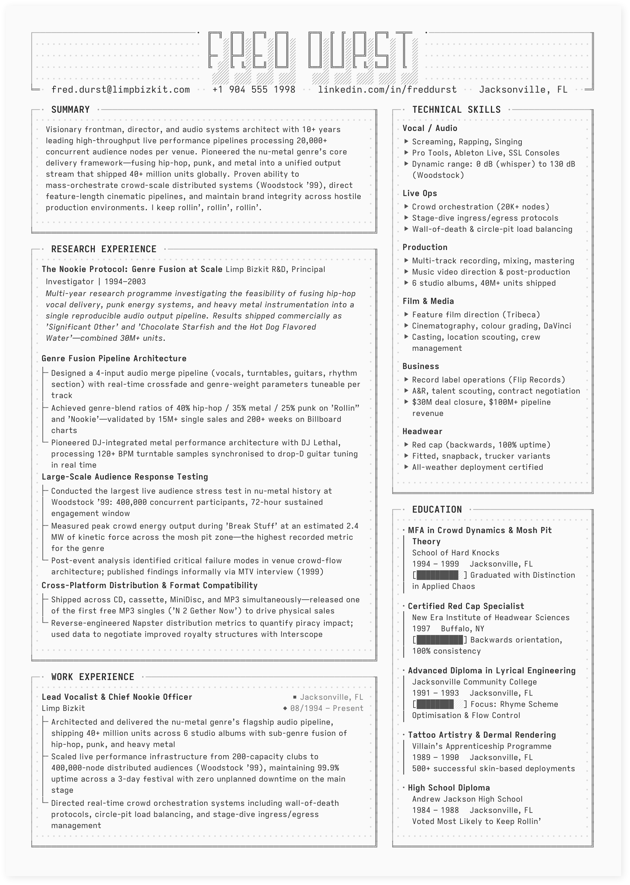
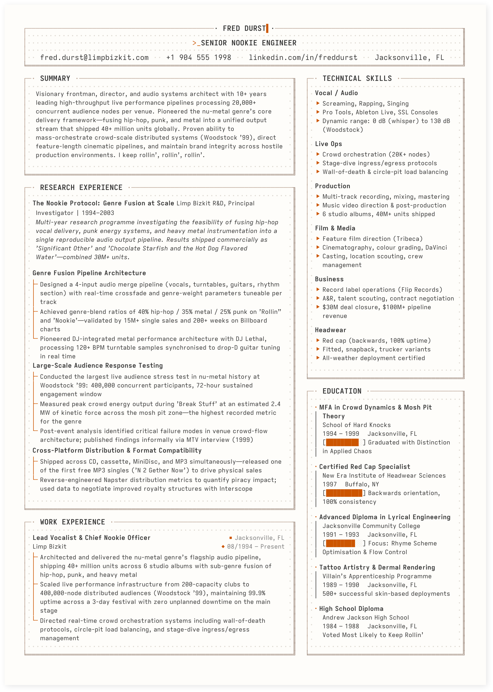
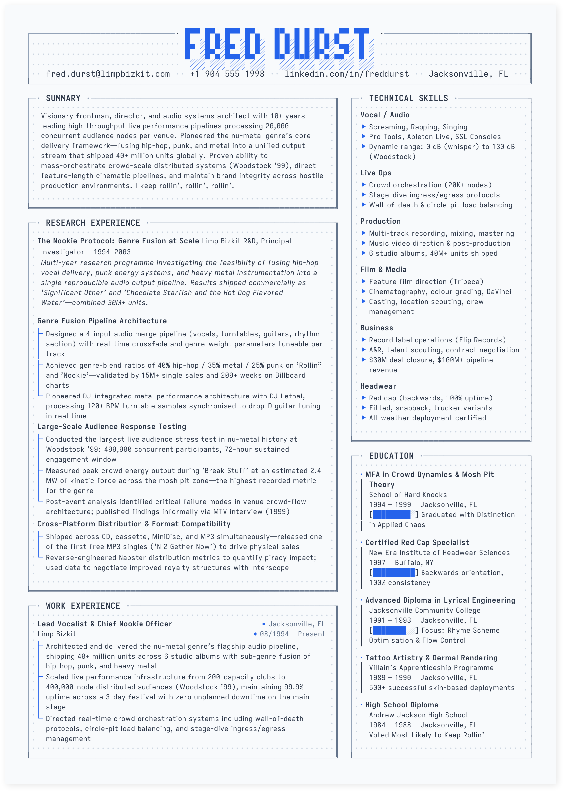
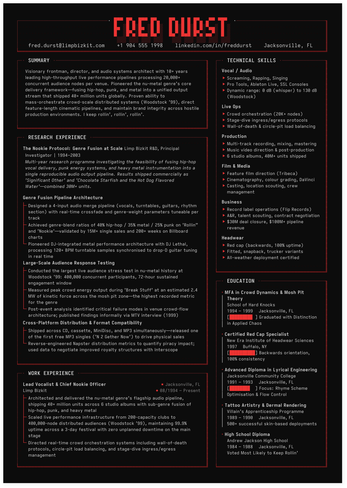

# Terminal-Native CV/Resume Builder -- Box-Drawing Grid + ATS-Optimised

A CV/resume that looks like it was rendered in a terminal. Because it was.

> **CV or resume?** Same thing, different continents. In the UK/EU a *curriculum vitae* (CV) is the standard job-application document; in the US it's called a *resume*. This project builds both formats from the same content -- set `paper_size: "a4"` for a CV or `"letter"` for a resume and the output adapts automatically. Throughout this README, **CV/resume** means whichever applies to you.

Monospaced box-drawing characters, tree-branch bullet connectors, dot-fill textures, and a character-cell grid that snaps every element to exact column positions -- the kind of layout you'd expect from a TUI, not a word processor. Text-driven interfaces are having a moment. Your CV/resume should reflect that.

One set of YAML files. Two PDFs. Zero LaTeX knowledge required. **Only requirement: [Docker](https://www.docker.com/) and Docker Compose.**

---

## What You Get

| | |
|---|---|
| **Designed CV/Resume** | A character-cell grid layout built from box-drawing characters -- `├─`, `└╴`, `┌──╖`, `╘══╝`. Tree connectors for bullets, dot-fill textures, progress bars, six colour themes including a dark CRT mode. The CV/resume equivalent of a well-crafted TUI. |
| **ATS CV/Resume** | The same content, stripped for the robots. Plain sections, standard fonts, no formatting tricks. Acronyms auto-expanded on first use. Passes applicant tracking systems cleanly. |

Both are generated from the **same YAML content** -- edit once, get both. Built for engineers who live in terminals, work with AI, and appreciate that the most interesting design work happening right now is text on a screen.

---

## Quick Start

```bash
# 1. Clone the repo
git clone https://github.com/donphi/cv-resume-ats-latex.git
cd cv-resume-ats-latex

# 2. Build both PDFs straight away (uses the example Fred Durst CV/resume)
./build.sh

# That's it. Two PDFs appear in the project root:
#   fred-durst-cv.pdf        (designed CV/resume)
#   fred-durst-cv-ats.pdf    (ATS-optimised CV/resume)

# 3. Make it yours — edit the YAML files in content/
#    Replace Fred Durst's details with your own, then rebuild:
./build.sh
```

> **The repo ships ready to build.** Every `content/*.yaml` file is pre-filled with a complete example CV/resume for Fred Durst. Build it first to see the output, then replace his details with yours. No template copying needed -- just edit the files in place.
>
> **Tip:** The YAML structure is deliberately simple. Paste any content file into an AI assistant (Claude, ChatGPT, etc.) and ask it to fill in your details -- it will understand the format instantly and hand you back a completed file ready to save.

### Build Flags

| Flag | What it does |
|------|--------------|
| `./build.sh` | Build both designed + ATS PDFs |
| `./build.sh -d` | Designed CV/resume only |
| `./build.sh -a` | ATS CV/resume only |
| `./build.sh -b` | Force-rebuild Docker images first |
| `./build.sh -c` | Remove all build artifacts |

### Output Files

Output filenames are derived from the `name` field in `content/contact.yaml` (lowercased, spaces become hyphens):

| Paper Size | Designed | ATS-Optimised |
|------------|----------|---------------|
| **A4** (UK/EU) | `fred-durst-cv.pdf` | `fred-durst-cv-ats.pdf` |
| **US Letter** | `fred-durst-resume.pdf` | `fred-durst-resume-ats.pdf` |

When you change `name: "Fred Durst"` to your own name, the output filenames update automatically (e.g. `jane-smith-cv.pdf`).

> 💡 Fonts are downloaded automatically on first build (~15 seconds). Subsequent builds skip the download.

---

## The Example: Fred Durst's CV/Resume

The repo ships with a complete example CV/resume for **Fred Durst** -- Senior Nookie Engineer, frontman of Limp Bizkit, and certified backwards-red-cap operator. Every YAML file is pre-filled so you can build immediately and see the output before editing your own content. The example data is deliberately absurd -- the aesthetic is the point.

### Side by Side

<!-- SCREENSHOT: Hero image — full-page side-by-side of both PDFs.
     Capture: Open fred-durst-cv.pdf and fred-durst-cv-ats.pdf side by side.
     Zoom to fit both full pages in one screenshot.
     Save as: doc/images/both-cvs-side-by-side.png
     Dimensions: ~1400px wide recommended. -->


*Left: the designed CV/resume with box-drawing grid layout. Right: the ATS-optimised version -- clean, parseable, no formatting tricks.*

### The Designed CV/Resume

<!-- SCREENSHOT: Full page 1 of the designed CV.
     Capture: Open fred-durst-cv.pdf, page 1, zoom to fit width.
     Save as: doc/images/page1.png -->


<!-- SCREENSHOT: Full page 2 of the designed CV.
     Capture: Open fred-durst-cv.pdf, page 2, zoom to fit width.
     Save as: doc/images/page2.png -->


The designed version uses a **character-cell grid** -- every element is placed on an exact monospaced grid, the same way a TUI renders to a terminal. The left column holds work experience and research; the right column holds education, skills, and contact details. What makes this different from every other LaTeX CV/resume template:

- **Box-drawing borders** -- `┌──╖`, `╘══╝`, `├─`, `└╴` characters form the section frames. Not images, not TikZ drawings -- actual Unicode box-drawing characters on a monospaced grid.
- **Tree connectors** -- bullet points use `├╴` / `└╴` with `│` continuation lines for multi-line items, exactly like `tree(1)` output.
- **Dot-fill textures** -- the `·` character fills empty space inside boxes, giving the layout a dense, terminal-native feel.
- **Progress bars** -- `[███████░░░]` terminal-style progress indicators for education entries.
- **Six colour themes** -- from professional blues to a dark-background CRT mode with red phosphor accents.

### Header Detail

<!-- SCREENSHOT: Zoomed crop of the header area (name, title, contact bar).
     Capture: Zoom to ~200% on the top of page 1, crop just the header
     section showing the name, title, and contact line with box-drawing borders.
     Save as: doc/images/detail-header.png
     Dimensions: ~1200px wide, ~300px tall. -->


*The header is built from `content/contact.yaml`. Name, title, email, phone, LinkedIn, and location -- all pulled from one file, rendered inside a box-drawing frame with dot-fill texture.*

### The ATS Version

<!-- SCREENSHOT: Full page 1 of the ATS CV/resume.
     Capture: Open fred-durst-cv-ats.pdf, page 1, zoom to fit width.
     Save as: doc/images/ats-page1.png -->


The ATS version strips all visual formatting. Plain sections, plain bullets, standard fonts. Acronyms are expanded on first use (e.g. "Artists and Repertoire (A&R)"). This is what applicant tracking systems read.

### Theme Gallery

<!-- SCREENSHOT: Theme gallery — grid showing the same CV header/section in all 6 themes.
     Capture: Build the CV with each theme active, crop the header + first section
     from each, arrange in a 2x3 or 3x2 grid. Label each with the theme name.
     Save as: doc/images/theme-gallery.png
     Dimensions: ~1400px wide recommended. -->

<p align="center">
  
  
</p>

<p align="center">
  
  
</p>

*The same CV/resume content rendered in all six built-in colour themes. Swap one block of 8 hex values in `engine/preamble.tex` to re-theme everything.*

---

## Project Structure

```
📦 cv-resume-ats-latex/
│
├── 📁 content/ ·································· ✏️ YOUR CV/RESUME TEXT GOES HERE
│   │
│   │   Each file maps to one section of your CV/resume.
│   │   Replace the Fred Durst example data with your
│   │   own — the build system handles all LaTeX formatting.
│   │
│   ├── contact.yaml ····························· Name, email, phone, links, paper size
│   ├── summary.yaml ····························· Professional summary paragraph
│   ├── work_experience.yaml ····················· Jobs: role, company, dates, bullets
│   ├── education.yaml ··························· Degrees, institutions, dates
│   ├── skills.yaml ······························ Skill categories and items
│   ├── research_experience.yaml ················· Research roles (optional)
│   ├── certifications.yaml ······················ Certifications (optional)
│   ├── publications.yaml ························ Papers, patents, albums (optional)
│   ├── acronyms.yaml ···························· ATS acronym expansions
│   └── layout.yaml ······························ Section order and column placement
│
├── 📁 engine/ ··································· 🔧 Layout templates (advanced users)
│   ├── preamble.tex ····························· Styling: fonts, colours, spacing, grid
│   ├── canvas.tex ······························· Auto-generated redirect — do not edit
│   ├── header.tex ······························· Header template (classic theme)
│   ├── header_crt.tex ··························· Header template (CRT theme)
│   ├── header_mainframe.tex ····················· Header template (mainframe theme)
│   ├── leftbox.tex ······························ Left column box template
│   ├── rightbox.tex ····························· Right column box template
│   ├── fullbox.tex ······························ Full-width box template
│   └── pageflow.tex ····························· Page break + header repeat logic
│
├── 📁 generated/ ································ 🤖 Auto-built .tex files — do not edit
├── 📁 build/ ···································· 🗑️ LaTeX intermediate files — gitignored
├── 📁 fonts/ ···································· 🔤 Iosevka typefaces (auto-downloaded)
├── 📁 scripts/ ·································· ⚙️ Python generator, layout engine
├── 📁 doc/ ······································ 📖 Deep-dive docs (grid sizing, ATS)
│
├── main.tex ····································· Entry point for designed CV/resume
├── main_ats.tex ································· Entry point for ATS CV/resume (auto-generated)
├── build.sh ····································· Build script
├── Dockerfile ··································· Designed CV/resume builder
├── Dockerfile.ats ······························· ATS CV/resume builder
├── docker-compose.yml
├── docker-compose.ats.yml
├── LICENSE ······································· MIT License
└── README.md
```

---

## Editing Your Content

All content lives in `content/*.yaml`. Open any file and replace Fred Durst's details with your own — each file has inline comments explaining the format. There is no separate template to copy; the example data **is** the template.

The files you will typically edit:

| File | What to change |
|------|----------------|
| `contact.yaml` | Your name, email, phone, LinkedIn, GitHub, location, paper size, header theme |
| `summary.yaml` | Your professional summary paragraph |
| `work_experience.yaml` | Your jobs — role, company, dates, bullet points |
| `education.yaml` | Your degrees, institutions, dates |
| `skills.yaml` | Your skill categories and items |
| `certifications.yaml` | Your certifications (or leave `entries: []` to hide) |
| `publications.yaml` | Your papers/patents (or leave `entries: []` to hide) |
| `research_experience.yaml` | Research roles (or leave `entries: []` to hide) |
| `acronyms.yaml` | Acronym expansions for the ATS version |
| `layout.yaml` | Section order and column placement |

> 💡 You can use `&`, `$`, `%`, `#`, `_`, `~` directly in your YAML — the build system escapes them for LaTeX automatically.

After editing, run `./build.sh` to regenerate both PDFs. Section placement is controlled by `content/layout.yaml` — see [Section Order and Columns](#section-order-and-columns--contentlayoutyaml) below.

---

### 📄 contact.yaml — Your Details, Paper Size, and Margin

```yaml
# content/contact.yaml

paper_size: "a4"          # "a4" (UK/EU → CV) or "letter" (US → Resume)
margin: 8.7               # page margin in mm — pick a sweet spot (see below)
header_theme: "classic"   # "classic", "crt", or "mainframe"
name: "Fred Durst"
title: "Senior Nookie Engineer"
email: "fred.durst@limpbizkit.com"
phone: "+1 904 555 1998"
linkedin: "linkedin.com/in/freddurst"
github: "github.com/freddurst"
location: "Jacksonville, FL"
full_cv_url: "https://freddurst.com/cv.pdf"
```

#### Margin Sweet Spots

The designed CV/resume uses a character grid. The margin must be a "sweet spot" so all four sides are equal:

| Paper size | Sweet spot margins (mm) | Default |
|------------|-------------------------|---------|
| **A4** (default) | 4.0 · **8.7** · 13.5 · 18.3 · 23.0 · 27.8 | **8.7** |
| **Letter** | 3.1 · 7.9 · **12.6** · 17.4 · 22.2 · 26.9 | **12.6** |

> 📖 See `content/contact.yaml` for the full ASCII diagram explaining how the grid works, or `doc/iosevka_sizing.md` for the deep derivation.

---

### 📄 summary.yaml — Professional Summary

```yaml
# content/summary.yaml

text: >-
  Visionary frontman, director, and audio systems architect with 10+ years
  leading high-throughput live performance pipelines processing 20,000+
  concurrent audience nodes per venue. I keep rollin', rollin', rollin'.
```

---

### 📄 work_experience.yaml — Jobs

```yaml
# content/work_experience.yaml

entries:
  - role: "Lead Vocalist & Chief Nookie Officer"
    company: "Limp Bizkit"
    dates: "Aug 1994 -- Present"
    location: "Jacksonville, FL"
    bullets:
      - "Scaled live performance infrastructure to 400,000-node distributed audiences"
      - "Negotiated and closed a $30M record deal with Interscope/Flip Records"
```

---

### 📄 education.yaml — Degrees and Courses

```yaml
# content/education.yaml

entries:
  - degree: "Certified Red Cap Specialist"
    institution: "New Era Institute of Headwear Sciences"
    dates: "1997"
    location: "Buffalo, NY"
    details: "Backwards orientation, 100% consistency"
    progress: 100    # optional progress bar (0-100), designed CV/resume only
```

---

### 📄 skills.yaml — Skill Groups

```yaml
# content/skills.yaml

groups:
  - category: "Headwear"
    items:
      - "Red cap (backwards, 100% uptime)"
      - "Fitted, snapback, trucker variants"
      - "All-weather deployment certified"
```

---

### 📄 research_experience.yaml — Research Roles (Optional)

Like work experience but with subsections for project groupings. Omit or leave `entries: []` to skip.

---

### 📄 certifications.yaml — Certifications (Optional)

Leave `entries: []` to omit. To add:

```yaml
# content/certifications.yaml

entries:
  - name: "RIAA Diamond Certification — Significant Other"
    issuer: "Recording Industry Association of America"
    year: "2001"

  - name: "Backwards Red Cap Operator Licence (Level 5)"
    issuer: "New Era Cap Company"
    year: "1997"
```

---

### 📄 publications.yaml — Albums, Papers, Patents (Optional)

Leave `entries: []` to omit. To add:

```yaml
# content/publications.yaml

entries:
  - authors: "Durst, F., Borland, W., Rivers, W., Otto, J., & Lethal, DJ"
    title: "Significant Other"
    venue: "Flip/Interscope Records (7x Platinum)"
    year: "1999"

  - authors: "Durst, F."
    title: "Patent: Method for Backwards Cap Aerodynamic Optimisation (US 6,969,420)"
    venue: "United States Patent and Trademark Office"
    year: "2002"
```

---

### 📄 acronyms.yaml — ATS Acronym Expansion

First occurrence of each acronym in the ATS PDF is expanded. The designed CV/resume is unaffected.

```yaml
# content/acronyms.yaml

acronyms:
  A&R: "Artists and Repertoire"
  RIAA: "Recording Industry Association of America"
  MTV: "Music Television"
  DJ: "Disc Jockey"
  BPM: "Beats Per Minute"
```

---

## Customising the Design (Advanced)

You should not need to touch these for basic use, but they are fully documented.

---

### Paper Size and Margins

Both are set in `content/contact.yaml`. The generator writes them into `generated/settings.tex`, which `engine/preamble.tex` loads before `\documentclass`. Nothing to edit in `engine/preamble.tex`.

---

### 🎨 Colour Themes — engine/preamble.tex section 4

Six built-in themes. Uncomment one block in the Tier 1 palette, comment the others, rebuild:

| Theme | Description |
|-------|-------------|
| **Warm Orange** | Cream background, burnt-orange accents. The default. |
| **Cool Blue** | Slate background tones, blue accents. Clean and corporate. |
| **Monochrome** | Black and white. No colour, all structure. |
| **Forest Green** | Warm off-white, green structural lines. Earthy and calm. |
| **Retrowave Red** | Dark CRT terminal. Red phosphor on black. The 1983 WarGames aesthetic. |
| **Crimson** | Light cream background with warm red accents. Professional but warm. |

#### Colour System Architecture

```
┌─────────────────────────────────────────────────────────────────┐
│                                                                 │
│  TIER 1: Palette ··········· 8 hex values — the only place      │
│                              hex codes exist. Swap one block    │
│                              to re-theme everything.            │
│                                                                 │
├─────────────────────────────────────────────────────────────────┤
│                                                                 │
│  TIER 2: Roles ············· Maps palette to functional         │
│                              categories (box lines, accents,    │
│                              text). Normally untouched.         │
│                                                                 │
├─────────────────────────────────────────────────────────────────┤
│                                                                 │
│  TIER 3: Elements ·········· Every visual element has its       │
│                              own colour name. Override any      │
│                              single one to break it out.        │
│                                                                 │
└─────────────────────────────────────────────────────────────────┘
```

---

### 🖥️ Header Themes — content/contact.yaml

The `header_theme` field in `content/contact.yaml` controls the header style for the designed CV/resume:

```yaml
header_theme: "classic"    # or "crt" or "mainframe"
```

| Theme | Description |
|-------|-------------|
| **classic** | Box-drawing frame with `┌──╖` / `╘══╝` borders, dot-fill texture, cursor block after name, `>_` prompt before title. Plain text name. |
| **crt** | Bitmap block-character name (`█▀▄`) with `░` phosphor-trail shading. 4-row ASCII art name, inspired by old CRT terminal displays. |
| **mainframe** | Double-line box-drawing name (`╔═╗║╚╝`) with `░` shadow. 5-row ASCII art name, inspired by mainframe punch-card printouts. |

Change the value, rebuild, and the header switches automatically. The layout engine adjusts header height per theme — no manual spacing needed.

#### Where the header files live

| File | Purpose |
|------|---------|
| `engine/header.tex` | Classic header template |
| `engine/header_crt.tex` | CRT header template |
| `engine/header_mainframe.tex` | Mainframe header template |
| `scripts/header.py` | Pre-renders the ASCII art name for CRT/mainframe themes |
| `scripts/font.py` | ASCII art glyph definitions (4-row and 5-row block fonts) |

The correct template is loaded automatically based on `header_theme` — the build script (`scripts/layout.py`) writes the `\input` for the active theme into `generated/canvas.tex`.

---

### 📐 Column Layout — engine/preamble.tex section 6

```latex
\newcommand{\LeftBoxWidth}{60}    % left column width in grid columns
\newcommand{\ColumnGap}{6}        % gap between columns
% RightBoxWidth is auto-derived: GridCols - LeftBoxWidth - ColumnGap
```

---

### 📄 Section Order and Columns — content/layout.yaml

> ⚠️ **This is the file you edit to control which sections appear, in what order, and in which column.** Do not edit `engine/canvas.tex` — it is auto-generated on every build and your changes will be overwritten.

```yaml
# content/layout.yaml

sections:
  - title: "SUMMARY"
    content: "summary.tex"
    column: "left"

  - title: "RESEARCH EXPERIENCE"
    content: "research_experience.tex"
    column: "left"

  - title: "WORK EXPERIENCE"
    content: "work_experience.tex"
    column: "left"

  - title: "TECHNICAL SKILLS"
    content: "skills.tex"
    column: "right"

  - title: "EDUCATION"
    content: "education.tex"
    column: "right"
```

| Field | Description |
|-------|-------------|
| `title` | The heading shown in the box border (e.g. `"SUMMARY"`) |
| `content` | The generated `.tex` filename (relative to `generated/`) |
| `column` | `"left"`, `"right"`, or `"full"` |

Sections within the same column are placed top-to-bottom in the order listed. Add, remove, or reorder entries here and rebuild — the layout engine handles page breaks automatically.

---

### 🔄 Automatic Page Breaks

Page breaks are computed automatically. The build pipeline runs a **two-pass compile**:

```
┌─────────────────────────────────────────────────────────────────┐
│                                                                 │
│  PASS 1 ······················ LuaLaTeX measures the exact      │
│                                height of every content box      │
│                                                                 │
│                                      │                          │
│                                      ▼                          │
│                                                                 │
│  LAYOUT ENGINE ··············· scripts/layout.py reads those    │
│                                heights, computes where page     │
│                                breaks fall, and splits any      │
│                                overflowing section at a clean   │
│                                boundary (between job entries,   │
│                                skill categories, education      │
│                                items, or research subsections)  │
│                                                                 │
│                                      │                          │
│                                      ▼                          │
│                                                                 │
│  PASS 2 ······················ LuaLaTeX compiles the final      │
│                                PDF with the computed layout     │
│                                                                 │
└─────────────────────────────────────────────────────────────────┘
```

You never need to manually insert page breaks or split content files. If your content grows or shrinks, just rebuild and the layout adjusts.

> ⛔ **`engine/canvas.tex` is off limits.** It is a one-line redirect to `generated/canvas.tex`, which is regenerated on every build. Any manual edits will be silently overwritten.

---

### 🔤 Font Sizing — engine/preamble.tex section 2

```latex
\newcommand{\GridFontSize}{9}        % base mono font size in pt
\newcommand{\MonoWidthRatio}{0.6}    % character width:height ratio
```

Changing `\GridFontSize` in `engine/preamble.tex` rescales the entire grid.

> 📖 See `doc/iosevka_sizing.md` for the derivation.

---

### 📏 Block Character Line Height — Why CRT/Mainframe Rows Are Taller

The CRT and mainframe headers use Unicode block and shade characters (`█`, `▀`, `▄`, `░`, `▓`, `║`) to render the ASCII art name. These characters are intentionally designed by the font to be **taller than the em-square** -- they span the full line height including the font's internal leading, so they tile seamlessly in terminal emulators.

**Measured facts** (Iosevka Extended at 9pt):

| Character type | Width | Height | Depth | Total | vs 9pt grid cell |
|---------------|-------|--------|-------|-------|-------------------|
| Regular text (`A`, `·`, `─`) | 5.4pt | 3.4--6.6pt | 0pt | 3.4--6.6pt | Fits |
| Block/shade (`█`, `░`, `║`, `│`) | 5.4pt | 8.685pt | 2.565pt | **11.25pt** | **+2.25pt overflow** |

The total 11.25pt = 9pt x 1.25, matching Iosevka's internal `leading = 1250/1000`. All characters are exactly 5.4pt wide (grid-perfect), but block characters extend 2.565pt below the baseline.

**How the headers handle this**: The `\FullHRow` macro in `engine/preamble.tex` (section 7.1) raises each row's content by its depth so all ink sits above the baseline. Rows use their **natural glyph height** (11.25pt for rows with block chars) instead of being forced into the 9pt grid cell. No clipping, no cutting -- the characters render at full size and tile seamlessly.

**Layout impact**: The header height in grid rows is computed per theme in `engine/preamble.tex` section 6:

| Theme | Full-height rows | Grid rows | Total grid rows (`\HeaderHeight`) |
|-------|-----------------|-----------|-----------------------------------|
| classic | 0 | 6 | **6** |
| crt | 4 | 2 | **7** |
| mainframe | 5 | 1 | **7** |

Content below the header starts at `\ContentStartY = \HeaderHeight + \GapHeaderToContent`. This is set automatically when you change `header_theme` -- no manual adjustment needed.

> **If you add or remove `\FullHRow` rows in a header template**, update the `\HeaderHeight` conditional in `engine/preamble.tex` section 6 to match. The math: each `\FullHRow` row occupies 1.25 grid rows; each `\vbox to \TPVertModule` row occupies 1 grid row. Round up the total.

---

## Fonts

Three [Iosevka](https://github.com/be5invis/Iosevka) families are used (15 TTF files, ~150 MB):

| Family | Role | Style |
|--------|------|-------|
| **Iosevka Extended** | Grid font (box borders, structural characters) | Monospace |
| **Iosevka Aile** | Body text (bullets, descriptions) | Proportional sans-serif |
| **Iosevka Etoile** | Display/headings (available, currently unused) | Proportional serif |

> 💡 **Fonts are downloaded automatically** from the [Iosevka GitHub releases](https://github.com/be5invis/Iosevka/releases) the first time you build. The script `scripts/fetch-fonts.sh` downloads only the 15 files needed, caches them in `fonts/iosevka/`, and skips the download on subsequent builds. No manual font installation required.

The font version is pinned in `scripts/fetch-fonts.sh` (currently v34.1.0). To update, change `IOSEVKA_VERSION`, delete the cached TTFs, and rebuild.

Custom build parameters are stored in `fonts/iosevka/parameters/` for reference (Iosevka's upstream config files, not used during LaTeX compilation).

---

## How It Works

```

┌─────────────────────────────────────────────────────────────────┐
│                      ✏️ you edit these                          │
│                       ─────────────────                         │
│                content/*.yaml  +  layout.yaml                   │
└────────────────────────────────┬────────────────────────────────┘
                                 │
                                 ▼
                    ┌────────────────────────┐
                    │   scripts/generate.py  │
                    │      YAML → LaTeX      │
                    └────────────┬───────────┘
                                 │
                                 │  outputs:
                                 │  ├── generated/*.tex ······ designed CV components
                                 │  ├── generated/settings.tex · paper size + margin
                                 │  ├── generated/.build-meta ·· dynamic output filenames
                                 │  └── main_ats.tex ·········· ATS CV (self-contained)
                                 │
                ┌────────────────┴────────────────┐
                │                                 │
                ▼                                 ▼
     ┌─────────────────────┐           ┌─────────────────────┐
     │    DESIGNED CV      │           │       ATS CV        │
     │                     │           │                     │
     │  layout.py --measure│           │      latexmk        │
     │         │           │           │    main_ats.tex     │
     │         ▼           │           │         │           │
     │  LuaLaTeX (pass 1)  │           │         ▼           │
     │  measure box heights│           │  {name}-cv-ats.pdf  │
     │  → build/boxheights │           └─────────────────────┘
     │         │           │           
     │         ▼           │           
     │  layout.py --layout │
     │  compute page breaks│
     │  split overflows    │
     │         │           │
     │         ▼           │
     │  LuaLaTeX (pass 2)  │
     │    final compile    │
     │         │           │
     │         ▼           │
     │    {name}-cv.pdf    │
     └─────────────────────┘
```

The generator reads plain YAML, escapes special characters for LaTeX, and writes two outputs:

1. **Designed CV/Resume**: individual `generated/*.tex` files using custom environments (`treelist`, `timeline`, `skilllist`). The layout engine (`scripts/layout.py`) measures each section's height, computes page breaks, and generates `generated/canvas.tex` which places them in boxes on a character-cell grid with automatic page breaks.

2. **ATS CV/Resume**: a single `main_ats.tex` file with plain `\section` / `\itemize` formatting, optimised for applicant tracking system parsers. Acronyms are expanded on first use.

Both outputs are compiled inside Docker containers. No local dependencies beyond Docker.

---

## Requirements

| Requirement | Notes |
|-------------|-------|
| **Docker** | Required |
| **Docker Compose** | Required |
| Python | ❌ Not needed locally |
| LaTeX | ❌ Not needed locally |
| Fonts | ❌ Not needed locally |

✅ Works on Linux, macOS, and Windows (WSL2)

---

## Further Documentation

| File | Contents |
|------|----------|
| 📖 `doc/iosevka_sizing.md` | Grid derivation, margin sweet spots, font metrics, column layout math |
| 📖 `doc/ats_requirements.md` | ATS formatting rules and constraints |
| 📖 `doc/ats_check.md` | ATS compliance checklist |
| 📖 `doc/ats_check2.md` | Extended ATS compliance analysis |

---

## License

[MIT License](LICENSE). Use it however you want.

Iosevka fonts are licensed separately under the [SIL Open Font License](https://github.com/be5invis/Iosevka/blob/main/LICENSE.md).